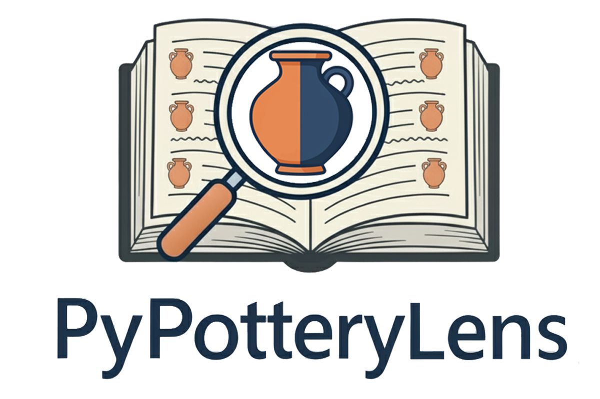

# PyPotteryLens

<div align="center">


[](https://lrncrd.github.io/PyPotteryLens/)
[](https://huggingface.co/lrncrd/PyPotteryLens)
[](https://www.python.org/downloads/)
[](https://arxiv.org/abs/2412.11574)
[](https://www.sciencedirect.com/science/article/pii/S2212054825000542)
[](https://github.com/lrncrd/PyPotteryLens)

---

### ☕ Support This Project

If you find PyPotteryInk useful for your research, consider supporting its development:

[](https://ko-fi.com/lrncrd)

Your support helps maintain and improve this open-source tool for the archaeological community!


</div>


## 🎯 Overview

As part of the [**PyPottery**](https://github.com/lrncrd/PyPottery) toolkit, `PyPotteryLens` is a Flask-based web application for archaeological pottery drawings recording. It provides a comprehensive suite of tools for processing, detecting, and analyzing pottery fragments from scanned documents, with an intuitive web interface and project-based workflow management.

## Features

- **🗂️ Project Management**: Organize your work with project-based workflow - each archaeological dataset gets its own workspace with dedicated folders and metadata tracking
- **📄 PDF Processing**: Convert multi-page PDF documents to high-quality images with support for split-page scanning
- **🤖 Fragment Detection**: State-of-the-art computer vision model (YOLO-based) for automatic pottery drawings detection with customizable confidence thresholds
- **✏️ Interactive Annotation Review**: Canvas-based editor for reviewing and adjusting detected masks with brush and eraser tools, zoom/pan support, visible brush/eraser cursor ring, and a colorize mode to spot fused mask regions at a glance
- **📐 Nested Vessel Handling**: LabelMe-style polygon drawing tool to manually outline vessels drawn inside other vessels; inner vessel areas are automatically subtracted from the outer card
- **📊 Tabular Data Management**: Integrated spreadsheet interface for adding archaeological metadata to detected instances, with AI-assisted extraction, canonical column names via `[bracket]` syntax, and per-drawing crop mode for small inventory numbers
- **🔄 Post Processing**: Grid view of all extracted pieces at real relative size with per-thumbnail flip, ENT/FRAG toggle, and exclude-from-export controls; automatic orientation correction using deep learning classifiers
- **🌐 Modern Web Interface**: Clean, responsive web UI accessible from any browser
- **💾 Auto-save**: Automatic progress saving ensures no data loss
- **📦 Export Tools**: Generate standardized outputs with custom acronyms; tabular data is merged and exported automatically as all-text CSV

## Installation

### Requirements

- Python 3.12 (tested)
- Modern web browser (Chrome, Firefox, Edge, Safari)
- 8GB RAM minimum (16GB recommended)
- Optional: NVIDIA GPU with CUDA support or MPS for faster processing

### Quick Installation (Windows)

1. **Download Python 3.12** from [Microsoft Store](https://www.microsoft.com/store/productId/9NRWMJP3717K?ocid=pdpshare) or from [python.org](https://www.python.org/downloads/)

2. **Download PyPotteryLens**: Clone or download this repository

3. **Run the installation script**: Double-click on `PyPotteryLens_WIN.bat`
   
   The script will:
   - Create a virtual environment (`venv`)
   - Install all dependencies automatically
   - Detect and configure CUDA if available
   - Download required models from HuggingFace
   - Launch the application in your default browser

4. **Access the application**: The web interface will open at `http://localhost:5001`

> ⚠️ **Troubleshooting**: If you encounter issues, delete the `venv` folder and run `PyPotteryLens_WIN.bat` again to perform a clean installation.

### UNIX Installation (Linux, macOS)

1. **Ensure Python 3.12 is installed**:

   ```bash
   python3 --version
   ```

2. **Download PyPotteryLens**: Clone or download this repository

3. **Run the installation script**:

   ```bash
   sh PyPotteryLens_UNIX.sh
   ```

4. **Access the application**: Open your browser at `http://localhost:5001`

> ⚠️ **Troubleshooting**: Delete the `venv` folder and rerun the script for a clean installation.

### Manual Installation (All Platforms)

1. **Download/Clone the repository**

2. **Create a virtual environment**:

   ```bash
   python -m venv venv
   
   # Activate on Windows:
   venv\Scripts\activate
   
   # Activate on UNIX:
   source venv/bin/activate
   ```

3. **Install PyTorch**:

   For **CPU-only** systems:

   ```bash
   pip install torch torchvision torchaudio
   ```

   For **NVIDIA GPU** systems with CUDA:

   ```bash
   # Check CUDA availability
   nvidia-smi
   
   # Install PyTorch with CUDA 12.6 support
   pip install torch torchvision torchaudio --index-url https://download.pytorch.org/whl/cu126
   ```

   For **Apple Silicon** (M1/M2/M3):

   ```bash
   pip install torch torchvision torchaudio
   ```
   PyTorch will automatically use MPS acceleration on Apple Silicon.

4. **Install other dependencies**:

   ```bash
   pip install -r requirements.txt
   ```

5. **Download models**: The application will automatically download required models from [HuggingFace](https://huggingface.co/lrncrd/PyPotteryLens) on first launch, or download them manually:
   - `BasicModelv8_v01.pt` → place in `models_vision/`
   - `model_classifier.pth` → place in `models_classifier/`

6. **Launch the application**:

   ```bash
   python app.py
   ```

7. **Open your browser** at `http://localhost:5001`


## Getting Started

### Launching the Application

**Windows**: Double-click `PyPotteryLens_WIN.bat`

**UNIX**: Run `sh PyPotteryLens_UNIX.sh`

**Manual**: Activate your virtual environment and run:

```bash
python app.py
```

The application will:
- Start a local web server
- Automatically open your default browser at `http://localhost:5001`
- Display initialization progress (model downloads, processor setup)

### First Steps

1. **Create a Project**: Click "New Project" and give it a name (e.g., "Veio_2024")
2. **Upload a PDF**: Navigate to the PDF Processing tab and upload your document
3. **Apply Detection Model**: Let the AI detect pottery fragments automatically
4. **Review & Refine**: Use the annotation editor to review and adjust detections
5. **Add Metadata**: Fill in archaeological information using the tabular interface
6. **Post-Process**: Auto-orient and classify fragments
7. **Export**: Generate final outputs with standardized naming

## Project Structure

The application organizes your work into projects, each with this structure:

```
projects/
└── YourProject_20250104_123456/
    ├── project.json              # Project metadata
    ├── pdf_source/               # Original PDF files
    ├── images/                   # Extracted page images
    ├── masks/                    # Detection masks (PNG with segmentation)
    ├── cards/                    # Individual pottery instances
    │   ├── mask_info.csv         # Metadata spreadsheet
    │   └── mask_info_annots.csv  # Bounding box annotations
    ├── cards_modified/           # Oriented/classified instances
    │   └── classifications.csv   # Classification results
    └── exports/                  # Final exported data
```

## Usage Workflow

### 1. 📁 Project Management

Create and organize your archaeological datasets as individual projects. Each project maintains:

- Workflow status tracking (PDF processed, model applied, cards extracted, etc.)
- Custom project icons for easy identification
- Metadata including creation date, description, and processing statistics
- Isolated folders for all processing stages

**Best Practices**:

- Use descriptive project names (e.g., "Capena_2018_Vol_II", "Veio_Excavation_2024")
- Projects are automatically timestamped to avoid conflicts
- You can work on multiple projects simultaneously

### 2. 📄 PDF Document Processing

Upload PDF files containing pottery drawings. The processor extracts high-quality images from each page.

**Options**:

- **Split Scanned Pages**: Enable this when your PDF contains two-page spreads (common in scanned books). The system will split each page into left and right halves.

**File Naming**: Use simple formats without spaces or special characters:

- ✅ Good: `Cardarelli_2022.pdf`, `MonteCimino_2025.pdf`
- ❌ Avoid: `My Document (2024) v2.pdf`

**Output**: Images are saved to `{project}/images/` with systematic naming:

- Standard: `ProjectName_page_0.jpg`, `ProjectName_page_1.jpg`, ...
- Split mode: `ProjectName_page_0a.jpg`, `ProjectName_page_0b.jpg`, ...

### 3. 🤖 Apply Detection Model

Run the YOLO-based computer vision model to automatically detect pottery fragments.

**Model Parameters**:

- **Confidence Threshold** (0.1-1.0): Controls detection sensitivity
  - Higher (0.7-0.9): Fewer detections, higher precision, misses difficult cases
  - Lower (0.3-0.5): More detections, catches subtle instances, may include false positives
  - Recommended: Start at 0.5 and adjust based on your dataset

- **Kernel Size**: Affects mask edge smoothing during post-processing
  - Larger values create smoother, more rounded edges
  - Smaller values preserve fine details
  - Recommended: 2-5 for most cases

- **Iterations**: Number of morphological operation passes
  - More iterations strengthen the smoothing/gap-closing effect
  - Can help close small gaps in masks
  - Recommended: 5-15 iterations

**Advanced Options**:

- **Diagnostic Mode**: Process only the first 25 images for quick parameter testing

- **Image Exclusion**: Exclude specific images from processing (useful for title pages, indices, etc.)

**Output**: Creates segmentation masks in `{project}/masks/` where detected pottery appears as semi-transparent overlays.

### 4. ✏️ Review Annotations & Extract Instances

Manually review and refine the automatic detections using an interactive canvas editor.

**Tools Available**:

- **Brush (🖌️)**: Add to masks, adjustable size (visible ring cursor)
- **Eraser (🧹)**: Remove parts of masks, adjustable size (visible dashed ring cursor)
- **Polygon (📐)**: Draw free-form polygons to define vessels nested inside other vessels. Double-click (or click near the first vertex) to close. Each polygon becomes an independent card at extraction time; the inner vessel area is subtracted (whitened) from the containing card automatically.
- **Colorize (🎨)**: Toggle political-map coloring — each disconnected mask region gets a distinct hue. Two regions sharing the same color are actually fused; use the eraser to separate them.

**Zoom & Pan**: Use the zoom controls (+/−/fit) or the mouse wheel to inspect details. The canvas fits the full page on load.

**Workflow**:

1. Browse through detected images using the file explorer
2. Click on any image to open the editor
3. Use brush/eraser to refine mask boundaries; use the Polygon tool to add nested vessels
4. Toggle Colorize to verify no masks are accidentally fused
5. Changes auto-save when you navigate away
6. Click "Extract Masks" when review is complete

**Output**: Individual pottery instances are saved to `{project}/cards/` with naming:

- `ProjectName_page_0_mask_layer_0.png`
- `ProjectName_page_0_mask_layer_1.png`
- etc.

Two CSV files are generated:

- `mask_info.csv`: Empty spreadsheet ready for metadata
- `mask_info_annots.csv`: Bounding box coordinates for each instance

### 5. 📊 Tabular Information

Add archaeological metadata to each detected pottery instance.

**Features**:

- View original images with bounding boxes highlighting each instance (toggle visibility with the switch)
- Navigate between pages and select specific instances
- Add custom columns for any metadata fields (e.g., "Fabric", "Chronology", "Context")
- Auto-save: Every cell edit is immediately saved
- Multi-instance pages: Easily switch between fragments on the same page
- **AI-assisted extraction**: Use `🤖 Extract AI References` (single page) or `🔄 Extract All (Batch)` to fill columns automatically using an AI backend (OpenRouter or local Gemma)
- **Canonical column names**: Write column names in `[square brackets]` inside the prompt to lock the exact JSON key the model will use — prevents column name drift across pages (e.g. `Add also [Scale], [Context]`)
- **Numbers from crops**: Enable this toggle to extract inventory/reference numbers by cropping and upscaling each individual drawing, improving accuracy for small labels
- **Clear Table**: Reset all values on the current page to start over without losing column structure

**Data Management**:

- Data is stored in `mask_info.csv` inside the `cards/` folder
- Avoid commas in cell values (CSV format limitation)
- For bulk editing, you can export and edit in Excel/Google Sheets

**Workflow**:

1. Click "Add Column" to create new metadata fields
2. Navigate through images using Previous/Next buttons
3. Click cells to edit values, or use AI extraction
4. Use instance selector for pages with multiple pottery fragments
5. Mark pages as "Reviewed" to track progress

### 6. 🔄 Post Processing

Automatically orient and classify pottery instances using deep learning.

**Processing Options**:

- **Auto Vertical Flip**: Detects and corrects upside-down pottery (mouth facing down → mouth facing up)
- **Auto Horizontal Flip**: Standardizes profile orientation (all profiles face left)

**Classification**: The model automatically categorizes each instance:

- **ENT** (Entire/Complete): Substantially complete pottery profiles — shown with a **blue** card border
- **FRAG** (Fragment): Partial or fragmentary profiles — shown with an **orange** card border

**Review Interface** (grid view):

After clicking "Process All Images", all pieces are displayed as a proportional grid — the largest piece maps to the maximum thumbnail size so that all cards are shown at their real relative dimensions.

Hover over any card to reveal controls:

- **↕ Flip Vertical / ↔ Flip Horizontal**: Override automatic orientation
- **ENT / FRAG pill**: Toggle classification; border color updates immediately
- **✕ Exclude**: Mark a card to be skipped at export time (card is greyed out)
- **Click image**: Open a full-screen lightbox for detailed inspection

**Output**: 

- Processed images saved to `{project}/cards_modified/`
- Classifications stored in `classifications.csv`
- Merge with metadata to create `merged_annotations.csv`

### 7. 📦 Export Results

Generate final outputs with standardized naming.

**Export Options**:

- **Acronym**: Assign a short identifier (e.g., "CRD", "VEII") for systematic file naming: files will be named: `{acronym}_1.png`, `{acronym}_2.png`, etc.

**Output**: 

- A single ZIP archive containing:
  - Renamed images (excluded cards are omitted automatically)
  - `{acronym}_metadata.csv` — merged tabular + classification data, all fields as plain text
- Tabular data is read directly from the working `mask_info.csv` — no intermediate export step required

## Technology Stack

**Backend**:

- **Flask**: Lightweight web framework for Python
- **PyTorch**: Deep learning framework (with CUDA/MPS support)
- **Ultralytics YOLO**: State-of-the-art object detection
- **timm**: PyTorch image models for classification

**Image Processing**:

- **Pillow (PIL)**: Image manipulation
- **scikit-image**: Advanced image processing algorithms
- **PyMuPDF**: PDF rendering and conversion
- **OpenCV (via scikit-image)**: Computer vision operations

**Data Management**:

- **pandas**: Tabular data handling and CSV operations
- **NumPy**: Numerical computing
- **ReportLab**: PDF generation for catalogs


Full dependency list available in `requirements.txt`

## Hardware Acceleration

PyPotteryLens automatically detects and uses available hardware acceleration:

- **NVIDIA GPU (CUDA)**: Recommended for fastest processing

  - Requires: CUDA-compatible GPU + drivers
  
- **Apple Silicon (MPS)**: Native support for M1/M2/M3 chips

  - Automatic MPS backend selection

  
- **CPU**: Fallback mode, works on all systems

  - No special requirements
  - Suitable for small to medium datasets

## Version History

### 0.3.0 (Current)

**Annotation tab**
   - **Nested vessel support**: New Polygon tool (LabelMe-style) to manually outline vessels drawn inside other vessels. Polygons are persisted as a sidecar JSON and extracted as independent cards at mask-extraction time; the inner vessel area is automatically whitened from the containing card (boolean subtraction)
   - **Zoom & pan**: Canvas now fits the full page on load; zoom in/out with +/−/fit buttons or the mouse wheel
   - **Brush/eraser cursor ring**: A visible size indicator ring follows the cursor so you always know what area you are painting or erasing
   - **Colorize mode (🎨)**: Toggle a political-map coloring where every disconnected mask region gets a distinct hue. Fused/merged regions share a color, making accidents immediately visible. Color is recomputed live after each brush stroke

**Tabular tab**
   - **AI extraction improvements**: Dynamic token budget prevents JSON truncation on dense pages; robust parser recovers partial responses
   - **Canonical column names**: Enclose column names in `[square brackets]` in the prompt to lock the exact JSON key the model will use — prevents key drift across batch runs
   - **Numbers from crops**: Optional toggle to extract per-drawing values (e.g. inventory numbers) by cropping and upscaling each individual figure, improving accuracy for small labels; applies to both single-page and batch extraction
   - **Box visibility toggle**: iOS-style switch to hide/show bounding boxes on the canvas
   - **Clear Table**: Reset all values on the current page without losing column structure
   - **Export Combined CSV removed**: Tabular data is now read directly from `cards/mask_info.csv` at export time — no manual intermediate step

**Post Processing tab**
   - **Grid view**: All extracted pieces are displayed together at real relative sizes (largest card = max thumbnail; proportional scaling for the rest), replacing the old one-at-a-time navigator
   - **Per-card hover controls**: flip vertical, flip horizontal, ENT/FRAG toggle, exclude from export — all without leaving the grid
   - **Border color coding**: blue border = ENT, orange border = FRAG for at-a-glance classification review
   - **Lightbox**: Click any card image to open a full-screen zoom view
   - **Exclude from export**: Cards marked with ✕ are skipped in the ZIP export (images and metadata rows)
   - **Progress bar**: Only visible while "Process All Images" is running
   - **Auto-flip toggles**: Replaced plain checkboxes with iOS-style toggle switches

**Export**
   - All metadata fields written as plain text in the output CSV (no implicit numeric coercion)

**Bug fixes**
   - Fixed flip endpoint applying to the wrong card when filenames sort lexicographically vs. naturally
   - Fixed small vessel area filter (was 4× too large due to counting RGBA channels); lowered minimum area ratio to 0.0002

### 0.2.1

   - **Major architectural change**: Migrated from Gradio to Flask web framework
   - **Project Management System**: Introduced project-based workflow with dedicated workspaces
   - **Modern Web Interface**: Native HTML/CSS/JavaScript frontend with improved UX
   - **RESTful API**: Full API for programmatic access and future integrations
   - **Enhanced Canvas Editor**: Improved annotation tools with better performance
   - **Real-time Progress Tracking**: Live updates for long-running operations
   - **Auto-save Everything**: Automatic persistence for all user changes
   - **Workflow Status Tracking**: Visual indicators for project completion stages
   - **Multi-project Support**: Work on multiple datasets simultaneously
   - **Improved Error Handling**: Better user feedback and error recovery

### 0.1.3

   - Minor bug fixes
   - Stability improvements

### 0.1.2

   - Checked compatibility with macOS Sonoma 15.2
   - Added MPS support for Apple Silicon devices
   - Added white border to extracted images for better visibility

### 0.1.1

   - Checked compatibility with Linux (Ubuntu 24.10) and macOS Sonoma 14
   - Improved bin packing algorithm for PDF catalog generation
   - Added paper's supporting scripts (PyPotteryLens: An Open-Source Deep Learning Framework)
   - Reworked GUI for better user experience
   
### 0.1.0

   - Initial release (Gradio-based application)

## System Compatibility

**Tested Operating Systems**:

- ✅ Windows 11
- ✅ Ubuntu 24.10
- ✅ macOS Sonoma 14
- ✅ macOS Sequoia 15.2
- ✅ macOS Tahoe 26


## Known Issues & Limitations

### Current Limitations


**Large PDF Files**: Processing very large PDFs (>500 pages) may take significant time. Recommendation: Split large documents into smaller sections.


### Platform-Specific Notes

**macOS (≤ Monterey 12.7.5)**:

- The maximum supported PyTorch version is `2.2.2`
- Modify `requirements.txt` to pin `torch==2.2.2` before installation

**Windows**:

- Some antivirus software may flag the batch script - this is a false positive
- You may need to run PowerShell with execution policy adjustments

**Linux**:

- Ensure you have `python3-venv` installed: `sudo apt install python3-venv`
- For GPU support, install NVIDIA drivers and CUDA toolkit separately

## Troubleshooting

### Application won't start

- **Delete `venv` folder** and rerun installation script
- Check Python version: `python --version` (should be 3.10-3.12)
- Verify no other application is using port 5000

### Model download fails

- Check internet connection
- Manually download models from [HuggingFace](https://huggingface.co/lrncrd/PyPotteryLens)
- Verify sufficient disk space (~500MB needed)

### CUDA not detected (Windows/Linux)

- Run `nvidia-smi` to verify drivers are installed
- Reinstall PyTorch with correct CUDA version
- Check that your GPU is CUDA-compatible

### MPS not working (macOS)

- Ensure you're on Apple Silicon (M1/M2/M3)
- Update to latest macOS (Monterey 12.3+)
- Verify PyTorch version supports MPS

### Slow processing

- Enable GPU acceleration if available
- Use Diagnostic Mode to test with fewer images
- Lower image resolution in PDF processing
- Close other heavy applications

### Browser shows "Connection Refused"

- Check that `app.py` is running without errors
- Verify firewall isn't blocking port 5001
- Try accessing via IP: `http://127.0.0.1:5001`


## Contributing

We welcome contributions to PyPotteryLens! Here are some ways you can help:

- 🐛 **Report bugs**: Open an issue with detailed reproduction steps
- 💡 **Suggest features**: Share ideas for new functionality
- 📖 **Improve documentation**: Help make the docs clearer
- 🧪 **Test on different platforms**: Help verify compatibility
- 💻 **Submit pull requests**: Code contributions are welcome

### Development Setup

1. Fork the repository
2. Create a feature branch: `git checkout -b feature/your-feature-name`
3. Make your changes
4. Test thoroughly
5. Submit a pull request

## Citation

If you use PyPotteryLens in your research, please cite:

```bibtex
@article{cardarelli2024pypotterylens,
  title={PyPotteryLens: An Open-Source Deep Learning Framework for Automated Digitisation of Archaeological Pottery Documentation},
  author={Cardarelli, Lorenzo},
  journal={arXiv preprint arXiv:2412.11574},
  year={2024}
}
```

## License

This project is licensed under the terms specified in the [LICENSE](LICENSE) file.

## Support & Contact

- **GitHub Issues**: For bug reports and feature requests
- **Email**: Contact the author for research collaborations
- **HuggingFace**: Model repository and discussion boards


## Roadmap

Future development plans include:

- [ ] Light / Dark mode toggle
- [ ] Executable packaging for easy distribution
- [ ] Automatic layout detection for tabular data


